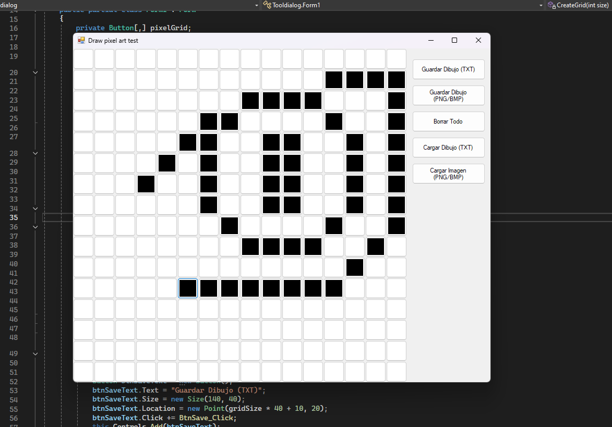

# PixelArt & ASCII Draw

## Description

PixelArt & ASCII Draw is a lightweight and intuitive application designed for creating pixel art and ASCII drawings with ease. Perfect for artists, hobbyists, and developers, this app provides a user-friendly canvas to unleash your creativity without any complexities.

### Features

- **Simple Interface:** The clean and minimalistic design allows users to focus solely on their artwork without distractions, making it ideal for both beginners and experienced artists.
- **Drawing Tools:** A variety of drawing tools are available, including a pencil, eraser, fill bucket, and color picker, enabling users to craft detailed designs effortlessly.
- **ASCII Mode:** Easily switch to ASCII mode to create intricate designs using text characters, perfect for integrating into coding projects or sharing on social platforms.
- **Zoom and Pan:** The zoom and pan functions allow for precise editing and detail work, giving users control over their creations.
- **Quick Export Options:** Save your artwork in PNG or TXT formats for easy sharing with friends or for use in your projects.
- **Cross-Platform Compatibility:** Accessible from any web browser, enabling users to create art on the go, whether on a computer, tablet, or smartphone.

## Installation

To get started, clone the repository and open the `index.html` file in your browser. An internet connection is required to load the necessary libraries.

## Contributions

Contributions are welcome! Feel free to open an issue or submit a pull request to enhance the application.

---

## Descripción

PixelArt & ASCII Draw es una aplicación ligera e intuitiva diseñada para crear arte en píxeles y dibujos en ASCII con facilidad. Perfecta para artistas, aficionados y desarrolladores, esta aplicación ofrece un lienzo fácil de usar para liberar tu creatividad sin complicaciones.

### Características

- **Interfaz Sencilla:** El diseño limpio y minimalista permite a los usuarios concentrarse únicamente en su arte sin distracciones, lo que la hace ideal tanto para principiantes como para artistas experimentados.
- **Herramientas de Dibujo:** Se dispone de una variedad de herramientas de dibujo, incluyendo lápiz, borrador, bote de relleno y selector de color, que permiten a los usuarios crear diseños detallados sin esfuerzo.
- **Modo ASCII:** Cambia fácilmente al modo ASCII para crear diseños intrincados usando caracteres de texto, perfecto para integrar en proyectos de programación o compartir en redes sociales.
- **Zoom y Desplazamiento:** Las funciones de zoom y desplazamiento permiten una edición precisa y un trabajo detallado, dando a los usuarios control sobre sus creaciones.
- **Opciones de Exportación Rápida:** Guarda tus obras en formatos PNG o TXT para compartir fácilmente con amigos o para usar en tus proyectos.
- **Compatibilidad Multiplataforma:** Accesible desde cualquier navegador web, lo que permite a los usuarios crear arte sobre la marcha, ya sea en una computadora, tableta o teléfono inteligente.

## Instalación

Para comenzar, clona el repositorio y abre el archivo `index.html` en tu navegador. Se requiere una conexión a Internet para cargar las bibliotecas necesarias.

## Contribuciones

¡Las contribuciones son bienvenidas! No dudes en abrir un issue o enviar un pull request para mejorar la aplicación.

---

